# Diagram Przepływu Autentykacji - Initiative Forge

Ten diagram przedstawia szczegółowy przepływ autentykacji w aplikacji Initiative Forge, wykorzystującej Next.js SPA, React i Supabase Auth.

**UWAGA:** Ten diagram został pierwotnie stworzony dla architektury Astro SSR. Po migracji do Next.js SPA:
- Zamiast Astro middleware → używamy client-side ProtectedRoute guard
- Zamiast Astro pages → używamy Next.js pages (App Router)
- Zamiast server-side sprawdzania sesji → używamy client-side AuthProvider
- API calls są wykonywane bezpośrednio z przeglądarki do Supabase (RLS zapewnia bezpieczeństwo)

## Aktorzy systemu (po migracji)

- **Przeglądarka** - Klient (użytkownik końcowy, React SPA)
- **AuthProvider/ProtectedRoute** - Client-side auth guard (Context API)
- **Next.js Pages** - Strony React w trybie SPA
- **Supabase Auth** - Serwis autentykacji Supabase
- **Baza Danych** - PostgreSQL z Row Level Security

## Główne zmiany po migracji

1. **Brak server-side middleware** - wszystko dzieje się client-side
2. **AuthProvider** (React Context) zarządza stanem autentykacji
3. **ProtectedRoute** component przekierowuje niezalogowanych użytkowników
4. **Direct Supabase calls** - bez warstwy API, RLS zapewnia bezpieczeństwo
5. **useAuth hook** - dostęp do stanu autentykacji w komponentach

## Przepływy autentykacji

```mermaid
sequenceDiagram
    autonumber

    participant Browser as Przeglądarka
    participant MW as Middleware
    participant Astro as Astro Pages/API
    participant Auth as Supabase Auth
    participant DB as Baza Danych
    participant Email as Email Service

    Note over Browser,Email: REJESTRACJA NOWEGO UŻYTKOWNIKA

    activate Browser
    Browser->>Astro: GET /auth/register
    activate Astro
    Astro->>MW: Sprawdź sesję
    activate MW
    MW->>Auth: getUser()
    Auth-->>MW: Brak sesji
    MW-->>Astro: Brak użytkownika
    deactivate MW
    Astro-->>Browser: Formularz rejestracji
    deactivate Astro

    Browser->>Browser: Wypełnienie formularza
    Browser->>Auth: signUp(email, password)
    activate Auth

    Auth->>Auth: Walidacja danych

    alt Email już istnieje
        Auth-->>Browser: Błąd: Email zajęty
    else Słabe hasło
        Auth-->>Browser: Błąd: Hasło za słabe
    else Dane poprawne
        Auth->>DB: Utwórz użytkownika
        activate DB
        Note over DB: status: unconfirmed
        DB-->>Auth: Użytkownik utworzony
        deactivate DB

        par Wysłanie emaila weryfikacyjnego
            Auth->>Email: Wyślij link weryfikacyjny
            activate Email
            Email-->>Browser: Email dostarczony
            deactivate Email
        and Odpowiedź do użytkownika
            Auth-->>Browser: Sukces - sprawdź email
        end
    end
    deactivate Auth

    Browser-->>Browser: Wyświetl komunikat o weryfikacji
    deactivate Browser

    Note over Browser,Email: WERYFIKACJA EMAILA

    activate Browser
    Browser->>Browser: Kliknięcie linku w emailu
    Browser->>Astro: GET /auth/callback?token=xyz
    activate Astro
    Astro->>Auth: verifyOtp(token)
    activate Auth

    alt Token nieprawidłowy lub wygasły
        Auth-->>Astro: Błąd weryfikacji
        Astro-->>Browser: Błąd: Link nieprawidłowy
    else Token prawidłowy
        Auth->>DB: Aktualizuj status użytkownika
        activate DB
        Note over DB: status: confirmed
        DB-->>Auth: Status zaktualizowany
        deactivate DB
        Auth-->>Astro: Weryfikacja pomyślna
        Astro-->>Browser: Przekierowanie do /auth/login
        Note over Browser: Komunikat: Email zweryfikowany
    end

    deactivate Auth
    deactivate Astro
    deactivate Browser

    Note over Browser,Email: LOGOWANIE

    activate Browser
    Browser->>Astro: GET /auth/login
    activate Astro
    Astro->>MW: Sprawdź sesję
    activate MW
    MW->>Auth: getUser()
    Auth-->>MW: Brak sesji
    MW-->>Astro: Brak użytkownika
    deactivate MW
    Astro-->>Browser: Formularz logowania
    deactivate Astro

    Browser->>Browser: Wypełnienie formularza
    Browser->>Auth: signInWithPassword(email, password)
    activate Auth

    Auth->>DB: Weryfikuj dane logowania
    activate DB
    DB-->>Auth: Hash hasła i status użytkownika
    deactivate DB

    alt Email niezweryfikowany
        Auth-->>Browser: Błąd: Potwierdź email
    else Nieprawidłowe dane
        Auth-->>Browser: Błąd: Nieprawidłowy email lub hasło
    else Dane poprawne
        Auth->>Auth: Generuj access token i refresh token
        Auth-->>Browser: Ustaw secure cookies (httpOnly)
        Note over Browser: Cookies: access_token, refresh_token
        Auth-->>Browser: Sesja utworzona
    end
    deactivate Auth

    Browser->>Browser: navigate(/campaigns)
    deactivate Browser

    Note over Browser,Email: DOSTĘP DO CHRONIONEJ STRONY

    activate Browser
    Browser->>MW: GET /campaigns (z cookies)
    activate MW
    MW->>MW: Utwórz klienta Supabase z cookies
    MW->>Auth: getUser() (weryfikacja JWT)
    activate Auth

    alt Token prawidłowy
        Auth->>Auth: Zweryfikuj sygnaturę JWT
        Auth-->>MW: User object
        MW->>Astro: context.locals.supabase, session
        activate Astro
        Astro->>DB: SELECT campaigns WHERE user_id = auth.uid()
        activate DB
        Note over DB: RLS weryfikuje dostęp
        DB-->>Astro: Lista kampanii użytkownika
        deactivate DB
        Astro-->>Browser: Strona z kampaniami
        deactivate Astro
    else Token wygasły
        Auth->>Auth: Próba auto-refresh
        Auth->>DB: Weryfikuj refresh token
        activate DB
        DB-->>Auth: Refresh token prawidłowy
        deactivate DB
        Auth->>Auth: Generuj nowy access token
        Auth-->>MW: Nowy token (aktualizacja cookies)
        MW-->>Browser: Ustaw nowe cookies
        MW->>Astro: Kontynuuj z nową sesją
        activate Astro
        Astro-->>Browser: Strona z danymi
        deactivate Astro
    else Refresh token nieprawidłowy
        Auth-->>MW: Błąd autoryzacji
        MW-->>Browser: Przekierowanie do /auth/login
        Note over Browser: Sesja wygasła - zaloguj się ponownie
    end

    deactivate Auth
    deactivate MW
    deactivate Browser

    Note over Browser,Email: WYLOGOWANIE

    activate Browser
    Browser->>Browser: Kliknięcie Wyloguj w UserMenu
    Browser->>Auth: signOut()
    activate Auth
    Auth->>DB: Usuń sesję z bazy
    activate DB
    DB-->>Auth: Sesja usunięta
    deactivate DB
    Auth-->>Browser: Usuń cookies
    deactivate Auth
    Browser->>Browser: localStorage.clear()
    Browser->>Browser: navigate(/auth/login)
    Note over Browser: Użytkownik wylogowany
    deactivate Browser

    Note over Browser,Email: RESET HASŁA

    activate Browser
    Browser->>Astro: GET /auth/reset-password
    activate Astro
    Astro-->>Browser: Formularz resetu hasła
    deactivate Astro

    Browser->>Browser: Wprowadzenie emaila
    Browser->>Auth: resetPasswordForEmail(email)
    activate Auth

    Auth->>DB: Sprawdź czy email istnieje
    activate DB
    DB-->>Auth: Użytkownik znaleziony
    deactivate DB

    Auth->>Email: Wyślij link do resetu hasła
    activate Email
    Email-->>Browser: Email dostarczony
    deactivate Email

    Auth-->>Browser: Sukces - sprawdź email
    deactivate Auth

    Browser-->>Browser: Wyświetl komunikat
    deactivate Browser

    activate Browser
    Browser->>Browser: Kliknięcie linku w emailu
    Browser->>Astro: GET /auth/callback?type=recovery
    activate Astro
    Astro->>Auth: Weryfikuj token recovery
    activate Auth

    alt Token nieprawidłowy
        Auth-->>Astro: Błąd weryfikacji
        Astro-->>Browser: Błąd: Link nieprawidłowy
    else Token prawidłowy
        Auth-->>Astro: Token zweryfikowany
        Astro-->>Browser: Formularz nowego hasła
    end
    deactivate Auth
    deactivate Astro

    Browser->>Browser: Wprowadzenie nowego hasła
    Browser->>Auth: updateUser(password: newPassword)
    activate Auth
    Auth->>DB: Aktualizuj hash hasła
    activate DB
    DB-->>Auth: Hasło zaktualizowane
    deactivate DB
    Auth-->>Browser: Hasło zmienione pomyślnie
    deactivate Auth

    Browser->>Browser: navigate(/auth/login)
    Note over Browser: Komunikat: Hasło zmienione, zaloguj się
    deactivate Browser

    Note over Browser,Email: ŻĄDANIE API Z AUTENTYKACJĄ

    activate Browser
    Browser->>MW: POST /api/campaigns (z cookies)
    activate MW
    MW->>Auth: getUser()
    activate Auth
    Auth-->>MW: User object (userId)
    deactivate Auth
    MW->>Astro: context.locals (supabase, session)
    activate Astro

    Astro->>Astro: Pobierz userId z sesji
    Astro->>DB: INSERT campaign (user_id = userId)
    activate DB
    Note over DB: RLS sprawdza czy user_id = auth.uid()
    DB-->>Astro: Kampania utworzona
    deactivate DB
    Astro-->>Browser: 201 Created (dane kampanii)
    deactivate Astro
    deactivate MW
    deactivate Browser
```

<mermaid_diagram>

</mermaid_diagram>

## Legenda

### Typy strzałek
- `->` - Synchroniczne żądanie HTTP
- `-->` - Odpowiedź HTTP (przerywana)
- `->>` - Wywołanie funkcji/metody
- `-->>` - Zwrócenie wartości (przerywana)

### Bloki warunkowe
- `alt`/`else`/`end` - Warunki (if/else)
- `par`/`and`/`end` - Operacje równoległe

### Notatki
- `Note over X,Y:` - Nagłówki sekcji
- `Note over X:` - Dodatkowe informacje

## Kluczowe mechanizmy bezpieczeństwa

1. **JWT Tokens** - Access token (krótkotrwały) + Refresh token (długotrwały)
2. **Secure Cookies** - httpOnly, sameSite, secure flags
3. **Auto-refresh** - SDK automatycznie odświeża wygasłe tokeny
4. **Row Level Security (RLS)** - Polityki na poziomie bazy danych
5. **Email Verification** - Obowiązkowa weryfikacja przed logowaniem
6. **Password Hashing** - Bcrypt z solą zarządzany przez Supabase
7. **Rate Limiting** - Wbudowany w Supabase Auth

## Ścieżki i komponenty (Next.js SPA)

### Strony autentykacji (Next.js Pages)
- `src/app/(auth)/login/page.tsx` - Strona logowania
- `src/app/(auth)/register/page.tsx` - Strona rejestracji
- `src/app/(auth)/reset-password/page.tsx` - Strona resetu hasła
- `src/app/(auth)/callback/page.tsx` - Obsługa callbacków z emaili

### Komponenty React
- `LoginForm.tsx` - Formularz logowania
- `RegisterForm.tsx` - Formularz rejestracji
- `PasswordResetForm.tsx` - Formularz resetu
- `ProtectedRoute.tsx` - Guard dla chronionych tras
- `UserMenu.tsx` - Menu użytkownika z opcją wylogowania
- `useAuth()` hook - Zarządzanie stanem autentykacji (Context API)

### Infrastruktura
- `src/providers/AuthProvider.tsx` - Provider dla stanu autentykacji
- `src/lib/supabase.ts` - Klient Supabase (singleton dla przeglądarki)
- `src/app/(dashboard)/layout.tsx` - Layout z ProtectedRoute
- Polityki RLS w Supabase dla tabel: campaigns, player_characters, combats
