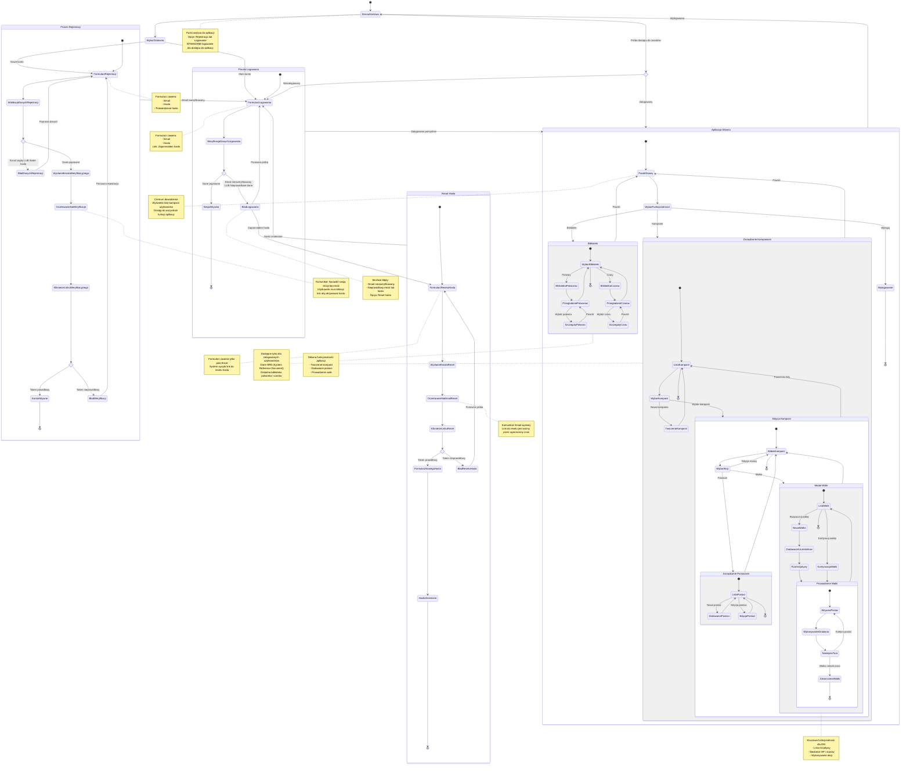

# Diagram Podróży Użytkownika - Initiative Forge

Ten diagram przedstawia doświadczenie użytkownika (User Journey) w aplikacji Initiative Forge, wizualizując główne ścieżki interakcji od momentu pierwszego kontaktu z aplikacją do aktywnego korzystania z jej funkcji.

## Opis diagramu

Diagram pokazuje:
- **Ścieżki nowego użytkownika** - od rejestracji do aktywacji konta
- **Ścieżki logowania** - uwierzytelnienie i dostęp do aplikacji
- **Ścieżki odzyskiwania hasła** - reset hasła dla użytkowników
- **Ścieżki korzystania z aplikacji** - główne funkcjonalności dla zalogowanych użytkowników
- **Punkty decyzyjne** - walidacja danych, weryfikacja, błędy
- **Stany użytkownika** - niezalogowany, oczekujący na weryfikację, zalogowany

**WAŻNE:** Cała aplikacja (w tym biblioteki potworów i czarów) jest dostępna WYŁĄCZNIE dla zalogowanych użytkowników.

<mermaid_diagram>

</mermaid_diagram>

## Kluczowe ścieżki użytkownika

### 1. Nowy użytkownik (Rejestracja)

**Start → Formularz rejestracji → Weryfikacja emaila → Logowanie → Panel główny**

1. Użytkownik wchodzi na stronę startową
2. Wybiera "Nowe konto"
3. Wypełnia formularz rejestracji
4. System weryfikuje dane (email unikalny, hasło silne)
5. Email weryfikacyjny zostaje wysłany
6. Użytkownik klika link w emailu
7. Konto zostaje aktywowane
8. Użytkownik loguje się
9. Dostęp do panelu głównego

**Punkty decyzyjne:**
- ❌ Email zajęty → Powrót do formularza
- ❌ Słabe hasło → Powrót do formularza
- ❌ Token weryfikacyjny nieprawidłowy → Błąd, możliwość ponownej rejestracji
- ✅ Wszystko OK → Konto aktywne, możliwość logowania

### 2. Powracający użytkownik (Logowanie)

**Start → Formularz logowania → Panel główny**

1. Użytkownik wchodzi na stronę startową
2. Wybiera "Mam konto"
3. Wprowadza email i hasło
4. System weryfikuje dane i status emaila
5. Sesja zostaje utworzona
6. Przekierowanie do panelu głównego

**Punkty decyzyjne:**
- ❌ Email niezweryfikowany → Komunikat błędu
- ❌ Nieprawidłowe dane → Komunikat błędu, opcja resetu hasła
- ✅ Dane poprawne → Zalogowanie i dostęp do aplikacji

### 3. Reset hasła

**Formularz logowania → "Zapomniałem hasła" → Reset → Logowanie**

1. Użytkownik klika "Zapomniałem hasła"
2. Wprowadza email
3. System wysyła link do resetu
4. Użytkownik klika link w emailu
5. Ustawia nowe hasło
6. Powrót do formularza logowania
7. Logowanie nowymi danymi

**Punkty decyzyjne:**
- ❌ Token resetu nieprawidłowy → Możliwość ponownej próby
- ✅ Token prawidłowy → Formularz nowego hasła → Sukces

### 4. Korzystanie z aplikacji (Zalogowany DM)

**Panel główny → Kampanie → Postacie → Walka**

1. Użytkownik widzi listę swoich kampanii
2. Tworzy nową kampanię lub wybiera istniejącą
3. Dodaje postacie graczy do kampanii
4. Rozpoczyna nową walkę
5. Dodaje uczestników (postacie + potwory z biblioteki)
6. System rzuca na inicjatywę
7. DM prowadzi walkę tura po turze
8. Wykonuje akcje, zadaje obrażenia, przypisuje stany

**Alternatywne ścieżki:**
- Przeglądanie bibliotek (potwory, czary) - dostępne tylko po zalogowaniu
- Edycja kampanii
- Edycja postaci
- Kontynuacja zapisanej walki
- Wylogowanie

## Stany użytkownika

| Stan | Opis | Dostępne akcje |
|------|------|----------------|
| **Niezalogowany** | Użytkownik bez sesji | Rejestracja, Logowanie |
| **Oczekujący na weryfikację** | Konto utworzone, email niezweryfikowany | Kliknięcie linku weryfikacyjnego |
| **Aktywny niezalogowany** | Email zweryfikowany, brak sesji | Logowanie |
| **Zalogowany** | Aktywna sesja | Pełny dostęp do aplikacji (kampanie, biblioteki) |
| **W trakcie edycji kampanii** | Zarządzanie kampanią | Postacie, Walka, Edycja |
| **W trakcie walki** | Prowadzenie starcia | Akcje, Obrażenia, Stany, Następna tura |

## Przejścia krytyczne

1. **Rejestracja → Weryfikacja** - Wymaga kliknięcia linku w emailu
2. **Weryfikacja → Logowanie** - Konto aktywne, można się zalogować
3. **Logowanie → Panel główny** - Dostęp do aplikacji
4. **Niezalogowany → Chronione zasoby** - Automatyczne przekierowanie do logowania
5. **Zalogowany → Wylogowanie** - Zakończenie sesji, powrót do strony startowej

## Szczególne przypadki

### Email niezweryfikowany
- Użytkownik próbuje się zalogować przed weryfikacją
- System wyświetla komunikat o konieczności weryfikacji
- Opcja ponownego wysłania emaila (planowane)

### Token wygasły
- Link weryfikacyjny lub resetujący wygasł
- System wyświetla komunikat błędu
- Możliwość rozpoczęcia procesu od nowa

### Dostęp do aplikacji bez logowania
- Użytkownik próbuje bezpośrednio wejść na dowolną stronę aplikacji (np. `/campaigns`, `/monsters`, `/spells`)
- Middleware wykrywa brak sesji
- Automatyczne przekierowanie do `/auth/login?redirect=[docelowa-strona]`
- Po zalogowaniu - powrót do docelowej strony

**WAŻNE:** Cała aplikacja, w tym biblioteki potworów i czarów, wymaga zalogowania zgodnie z wymaganiami PRD (sekcja 3.1: "Tylko zalogowany użytkownik ma dostęp do dalszych modułów aplikacji")
