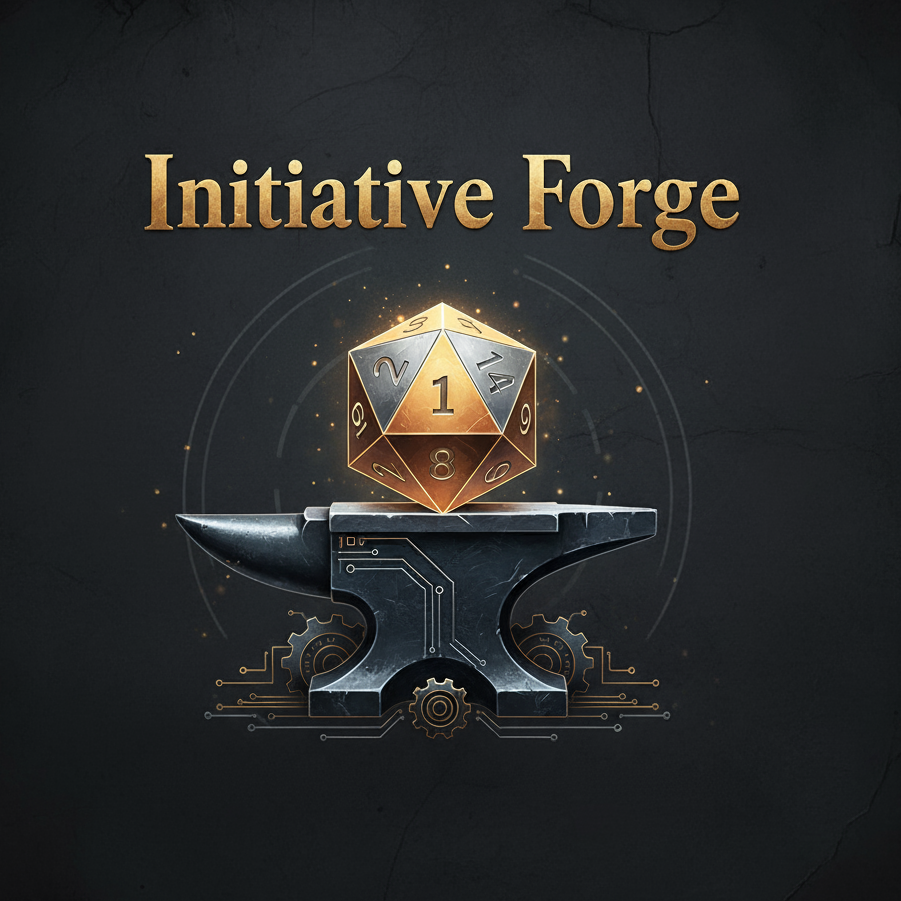

<div align="center">
  

  # Initiative Forge

  **A Command Center for D&D 5e Dungeon Masters**

  [](https://www.typescriptlang.org/)
  [](https://nextjs.org/)
  [](https://react.dev/)
  [](https://supabase.com/)
  [](https://tailwindcss.com/)
  [](LICENSE)

</div>

---

## About

**Initiative Forge** is a modern web application designed to streamline and enhance the Dungeon Master experience for D&D 5e sessions. It serves as a centralized command center that simplifies campaign management and real-time combat tracking, allowing DMs to focus on storytelling rather than juggling rulebooks and tracking spreadsheets.

### Key Features

- **Campaign Management** - Create and organize campaigns with player character rosters
- **Global Libraries** - Instant access to searchable SRD-based monster and spell databases
- **Combat Tracker** - Real-time initiative tracking, HP management, and condition monitoring
- **Automated Dice Rolling** - Built-in dice mechanics with advantage/disadvantage support
- **Intuitive Interface** - Clean, responsive UI built with modern design principles

---

## Tech Stack

### Frontend
- **[Next.js 16](https://nextjs.org/)** - App Router with dynamic routing
- **[React 19](https://react.dev/)** - Modern UI library with TypeScript 5
- **[Tailwind CSS 4](https://tailwindcss.com/)** - Utility-first CSS framework
- **[Zustand](https://zustand-demo.pmnd.rs/)** - Lightweight state management
- **[TanStack Query v5](https://tanstack.com/query)** - Server state management and caching
- **[React Hook Form](https://react-hook-form.com/)** + **[Zod](https://zod.dev/)** - Type-safe form validation
- **[Radix UI](https://www.radix-ui.com/)** + **[shadcn/ui](https://ui.shadcn.com/)** - Accessible component primitives

### Backend
- **[Supabase](https://supabase.com/)** - PostgreSQL database with Row-Level Security (RLS)
- **Supabase Auth** - Built-in authentication with email/password support

### Testing
- **[Vitest](https://vitest.dev/)** - Fast unit and component testing
- **[React Testing Library](https://testing-library.com/react)** - Component testing utilities
- **[Playwright](https://playwright.dev/)** - End-to-end browser testing

### CI/CD & Hosting
- **GitHub Actions** - Automated testing and deployment pipelines
- **Vercel** - Production hosting with zero-config Next.js deployment

---

## Prerequisites

- **Node.js** 22.14.0 or higher
- **npm** or **yarn** package manager
- **Supabase account** (for database and authentication)

---

## Getting Started

### 1. Clone the Repository

```bash
git clone https://github.com/yourusername/initiative-forge-next.git
cd initiative-forge-next
```

### 2. Set Node Version

This project uses Node.js 22.14.0. If you're using [nvm](https://github.com/nvm-sh/nvm):

```bash
nvm use
```

### 3. Install Dependencies

```bash
npm install
```

### 4. Configure Environment Variables

Create a `.env.local` file in the project root:

```bash
cp .env.example .env.local
```

Add your Supabase credentials:

```env
NEXT_PUBLIC_SUPABASE_URL=your_supabase_project_url
NEXT_PUBLIC_SUPABASE_ANON_KEY=your_supabase_anon_key
NEXT_PUBLIC_APP_URL=http://localhost:3000
```

For end-to-end tests, also create `.env.test` with test database credentials.

### 5. Run the Development Server

```bash
npm run dev
```

Open [http://localhost:3000](http://localhost:3000) in your browser to see the application.

### 6. Deploy to Vercel (Optional)

[](https://vercel.com/new/clone?repository-url=https://github.com/yourusername/initiative-forge-next)

**Manual Deployment:**

1. Push your code to GitHub
2. Sign up at [vercel.com](https://vercel.com) and connect your GitHub account
3. Import your repository
4. Add environment variables:
   - `NEXT_PUBLIC_SUPABASE_URL`
   - `NEXT_PUBLIC_SUPABASE_ANON_KEY`
   - `NEXT_PUBLIC_APP_URL` (your Vercel domain)
5. Deploy

Vercel will automatically detect Next.js configuration and deploy with optimal settings. Preview deployments are created for every pull request.

---

## Available Scripts

### Development

| Command | Description |
|---------|-------------|
| `npm run dev` | Start Next.js development server at `http://localhost:3000` |
| `npm run build` | Create optimized production build |
| `npm start` | Start production server (requires `npm run build` first) |
| `npm run lint` | Run ESLint to check code quality |

### Unit Testing

| Command | Description |
|---------|-------------|
| `npm run test` | Run Vitest in interactive watch mode |
| `npm run test:unit` | Run unit tests once and exit |
| `npm run test:unit:watch` | Run unit tests in watch mode |
| `npm run test:unit:ui` | Open Vitest UI for visual test debugging |
| `npm run test:unit:coverage` | Generate code coverage report |

### End-to-End Testing

| Command | Description |
|---------|-------------|
| `npm run test:e2e` | Run Playwright tests (auto-starts dev server) |
| `npm run test:e2e:ui` | Open Playwright UI for interactive testing |
| `npm run test:e2e:headed` | Run tests with visible browser window |
| `npm run test:e2e:debug` | Debug Playwright tests with breakpoints |
| `npm run test:e2e:report` | View last Playwright test report |
| `npm run test:cleanup` | Clean up test data from database |

---

## Project Scope

Initiative Forge MVP focuses on delivering core functionality for D&D 5e session management:

### User Authentication
- Email and password registration with verification
- Secure login with session management
- Password recovery flow

### Campaign Management
- Create and organize multiple campaigns
- Add simplified player character cards with essential stats:
  - Name, HP, AC, Speed
  - Six ability scores (STR, DEX, CON, INT, WIS, CHA)
  - Auto-calculated initiative modifier and passive perception

### Global Monster Library
- Searchable database of SRD monsters
- Filter by Challenge Rating (CR)
- Detailed stat blocks with actions and abilities

### Global Spell Library
- Searchable database of SRD spells
- Filter by spell level (0-9)
- Filter by class (Wizard, Cleric, etc.)
- Complete spell descriptions and mechanics

### Real-Time Combat Tracker
- Create and manage combat encounters
- Add player characters, monsters, and NPCs
- Automated initiative rolling and turn order
- HP tracking with damage and healing inputs
- Condition management with rule references
- Action execution with automated dice rolling
- Advantage/disadvantage support
- Visual indication of active turn and knocked-out combatants

### Out of Scope for MVP
- Mobile-optimized responsive design
- Magic item library
- Session notes and world-building tools
- Automatic combat state snapshots
- Advanced character sheets (inventory, backstory, etc.)

---

## Project Status

🚧 **MVP in Active Development**

Initiative Forge is currently in the Minimum Viable Product phase. Core features are being implemented and tested. The application is functional but may undergo significant changes as development continues.

### Recent Progress
- ✅ Authentication system with Supabase
- ✅ Campaign and character management
- ✅ Monster and spell libraries
- ✅ Combat tracking with initiative and HP management
- ✅ Real-time dice rolling mechanics
- ✅ Unit and E2E test infrastructure

### Roadmap
- 🔄 UI/UX refinement and polish
- 🔄 Additional combat features (area effects, multi-target actions)
- 📋 User feedback integration
- 📋 Performance optimization

---

## Acknowledgments

- **D&D 5e SRD** - Monster and spell data courtesy of Wizards of the Coast
- **Supabase** - Backend infrastructure and authentication
- **shadcn/ui** - Beautiful, accessible component library
- **Radix UI** - Primitive component foundation

---

<div align="center">
  Made with ⚔️ for Dungeon Masters everywhere
</div>
